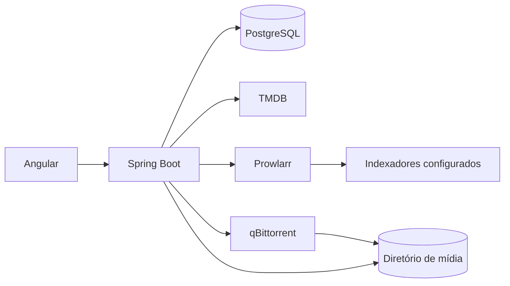

# Arquitetura do QLC Stream

## Contexto

O QLC Stream é uma aplicação local, de usuário único, que cataloga filmes, consulta opções disponibilizadas por indexadores configurados pelo usuário, delega transferências a um cliente externo e registra arquivos locais. O navegador nunca acessa diretamente credenciais nem caminhos arbitrários do computador.

## Contêineres planejados



O Compose sobe Angular, Spring Boot, PostgreSQL, Prowlarr e qBittorrent. As interfaces administrativas de Prowlarr e qBittorrent são vinculadas a `localhost`.

## Módulos do backend

- `catalog`: metadados do TMDB e cache local.
- `search`: busca, normalização e ordenação de opções.
- `downloads`: fila durável, comandos e reconciliação do motor.
- `library`: raízes de armazenamento e arquivos encontrados.
- `shared`: contratos e infraestrutura compartilhada estritamente necessários.

As integrações externas ficarão atrás de portas do domínio. O núcleo não dependerá de DTOs do TMDB, Prowlarr ou qBittorrent.

Cada módulo adota arquitetura hexagonal de forma pragmática:

```text
<modulo>/
├── domain/                 # modelo e regras sem dependências de framework
├── application/
│   ├── port/in/            # casos de uso oferecidos pelo módulo
│   ├── port/out/           # dependências exigidas pelo módulo
│   └── service/            # orquestração dos casos de uso
└── infrastructure/
    ├── web/                # controllers Spring MVC e DTOs HTTP
    ├── persistence/        # JPA e PostgreSQL
    └── <integracao>/       # TMDB, Prowlarr, qBittorrent ou sistema de arquivos
```

Spring MVC é um adaptador de entrada. JPA, TMDB e os demais serviços são adaptadores de saída. O código de `domain` e `application` não recebe DTOs nem entidades dessas tecnologias.

## Primeira fatia implementada

O módulo `catalog` já oferece:

- `GET /api/catalog/trending?language=pt-BR&page=1`
- `GET /api/catalog/search?query=<titulo>&language=pt-BR&page=1`

O fluxo consulta o `MovieMetadataProvider`, converte a resposta externa para o modelo `Movie` e atualiza o cache do PostgreSQL por `tmdb_id`. Quando `TMDB_API_TOKEN` não está definido, o adaptador retorna um problema HTTP `503` com uma mensagem de configuração.

## Decisões iniciais

- Monólito modular para reduzir custo operacional sem misturar responsabilidades.
- Flyway como fonte da estrutura do banco; Hibernate apenas valida o esquema.
- Identificadores UUID para downloads e chaves de idempotência.
- Caminhos locais persistidos como raiz cadastrada mais caminho relativo.
- Estado operacional consultado no qBittorrent e estado histórico persistido no PostgreSQL.
- HTTP para consultas e comandos; SSE para atualizações de downloads ativos.

## qBittorrent no ambiente local

O qBittorrent usa a imagem oficial e persiste sua configuração em `data/qbittorrent-official`. Em instalações Docker Desktop, mantenha `WebUI\HostHeaderValidation=false` na seção `[Preferences]` de `qBittorrent.conf`. O contêiner deve estar parado antes de editar esse arquivo, pois ele é regravado ao encerrar. Esse ajuste permite acessar a WebUI pela porta local publicada pelo Compose.

## Sequência incremental

1. Fundação, catálogo TMDB e telas de catálogo/detalhes.
2. Prowlarr, normalização de resultados e seleção de qualidade.
3. qBittorrent, fila durável, reconciliação e progresso em tempo real.
4. Biblioteca local, verificação de arquivos, espaço em disco e remoção coordenada.
