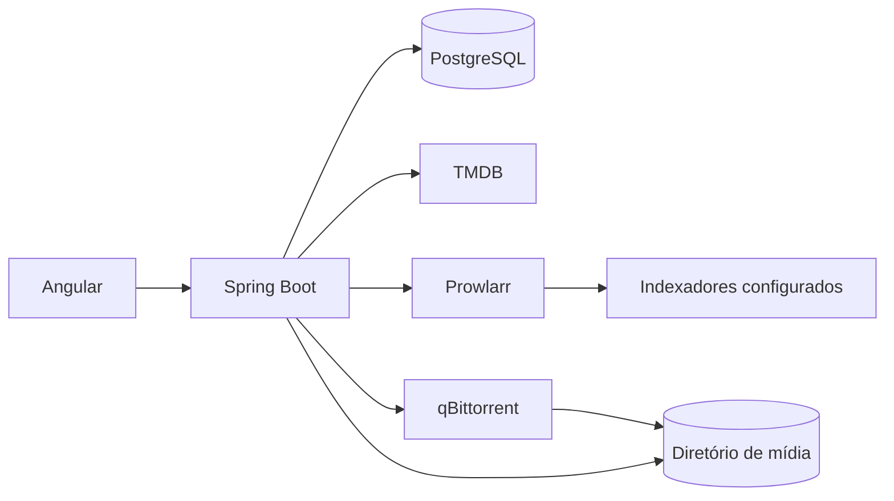

# Arquitetura do QLC Stream

## Contexto

O QLC Stream é uma aplicação local, de usuário único, que cataloga filmes, consulta opções disponibilizadas por indexadores configurados pelo usuário, delega transferências a um cliente externo e registra arquivos locais. O navegador nunca acessa diretamente credenciais nem caminhos arbitrários do computador.

## Contêineres planejados

Na primeira entrega, o Compose sobe Angular, Spring Boot e PostgreSQL. Prowlarr e qBittorrent serão acrescentados junto das integrações, evitando publicar interfaces administrativas antes de definir credenciais e volumes.

## Módulos do backend

- `catalog`: metadados do TMDB e cache local.
- `search`: busca, normalização e ordenação de opções.
- `downloads`: fila durável, comandos e reconciliação do motor.
- `library`: raízes de armazenamento e arquivos encontrados.
- `shared`: contratos e infraestrutura compartilhada estritamente necessários.

As integrações externas ficarão atrás de portas do domínio. O núcleo não dependerá de DTOs do TMDB, Prowlarr ou qBittorrent.

## Decisões iniciais

- Monólito modular para reduzir custo operacional sem misturar responsabilidades.
- Flyway como fonte da estrutura do banco; Hibernate apenas valida o esquema.
- Identificadores UUID para downloads e chaves de idempotência.
- Caminhos locais persistidos como raiz cadastrada mais caminho relativo.
- Estado operacional consultado no qBittorrent e estado histórico persistido no PostgreSQL.
- HTTP para consultas e comandos; SSE para atualizações de downloads ativos.

## Sequência incremental

1. Fundação, catálogo TMDB e telas de catálogo/detalhes.
2. Prowlarr, normalização de resultados e seleção de qualidade.
3. qBittorrent, fila durável, reconciliação e progresso em tempo real.
4. Biblioteca local, verificação de arquivos, espaço em disco e remoção coordenada.
